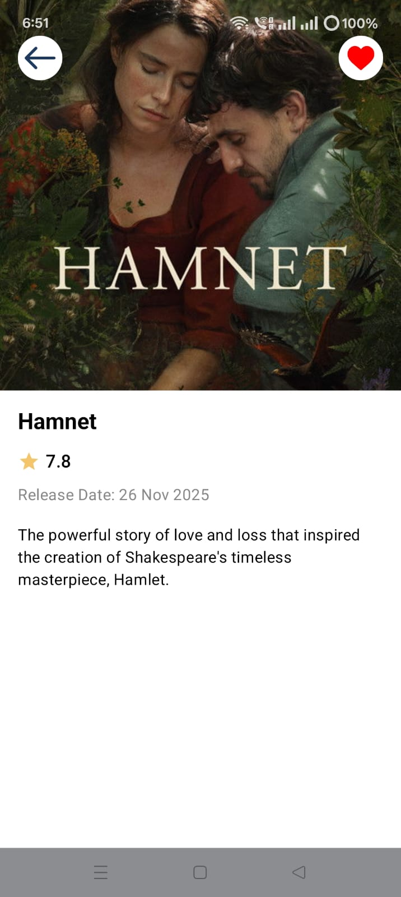
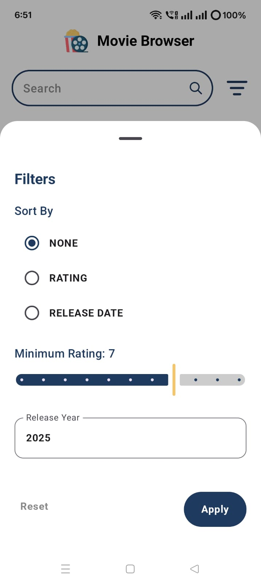

Movie Browser App
Overview
Movie Browser is a modern Android application built using Kotlin and Jetpack Compose.
It allows users to browse, search, filter, and view movie details using the TMDB API.
The app supports offline browsing through Room caching and Paging 3 RemoteMediator.

Tech Stack
Kotlin
Jetpack Compose
MVVM + Clean Architecture
Paging 3
Room
Retrofit + Moshi
Hilt
Coroutines & Flow

Architecture
The project follows Clean Architecture:
Presentation
↓
Domain
↓
Data
↓
Core
Domain layer is framework-independent.
Repository acts as single source of truth.
RemoteMediator synchronizes network and local cache.

Features
Paginated movie list
Debounced search
Filter by rating, year, and sort
Movie detail screen
Add/remove favourites
Offline mode support
Global connectivity observer

Offline Strategy
Room database stores cached movies
Paging reads from local DB
RemoteMediator fetches remote data in background
Repository falls back to local data if network fails

API Configuration
This project uses TMDB Bearer Token authentication.

The token is injected via BuildConfig and added through an OkHttp interceptor.

How to Run
Clone repository
Add API credentials in gradle.properties
Sync project
Run on emulator/device (minSdk 26)

## 📸 Screenshots

### Home Screen

### Detail Screen

### Filter Bottom Sheet

